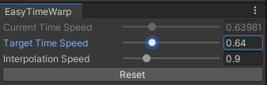

# EasyTimeWarp - Unity Editor Time Scale Changer

EasyTimeWarp is a simple Unity Editor Window script that enables easy manipulation of time scale within the Unity Editor.

## Features

- Adjust the time scale within a defined range (0.1f - 2.0f).
- Set a target time scale for gradual changes over time.
- Customize the interpolation speed for smooth transitions.
- Reset the time scale to its default value.

## Installation & Usage

1. **Download**: Clone, Copy or download the `EasyTimeWarp.cs` script.
2. **Usage**:
   - Place the script somewhere in your Unity project's folder.
   - Find the window under `Window -> EasyTimeWarp`.
   - Adjust the sliders for "Target Time Speed" and "Interpolation Speed" to modify the time scale.
   - timeScale label is updated with the default editor UI update signals.

## Note

- This tool is not meant to be used as a slow-motion achiever in production games.
- The time scale changes will affect the Unity Editor and not the final build of the project.
- Adjustments made persist between Editor sessions.

## License

This project is licensed under the [MIT License](LICENSE).
